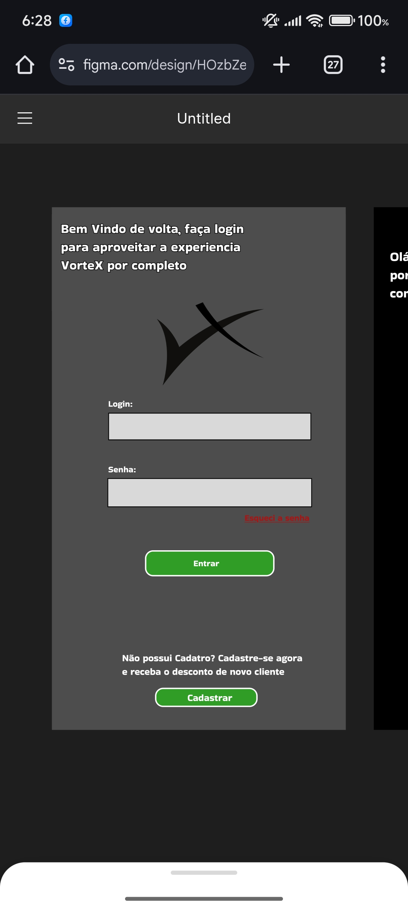
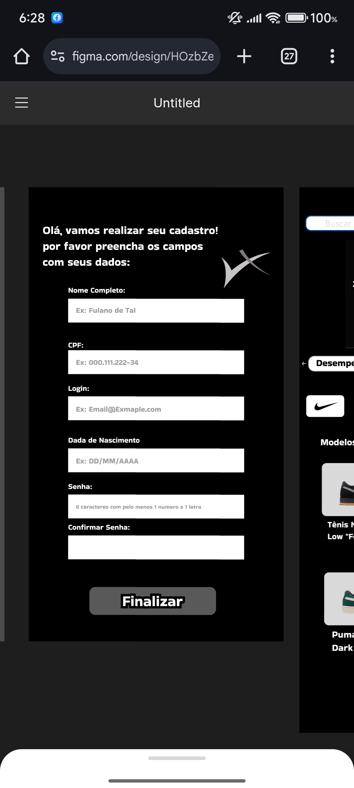
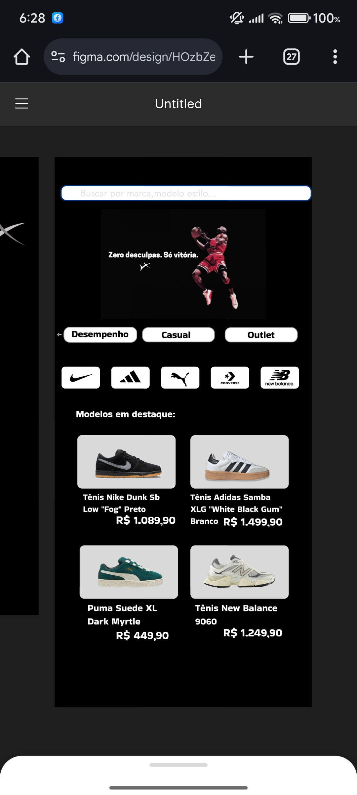
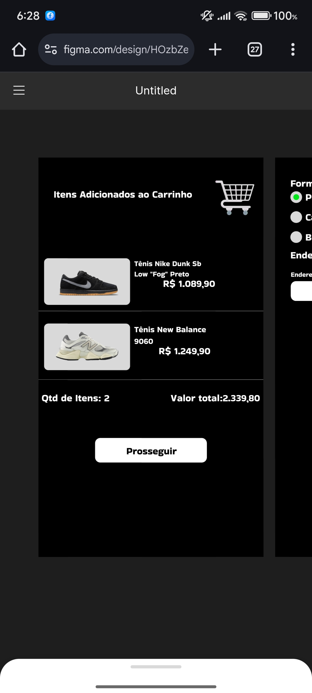
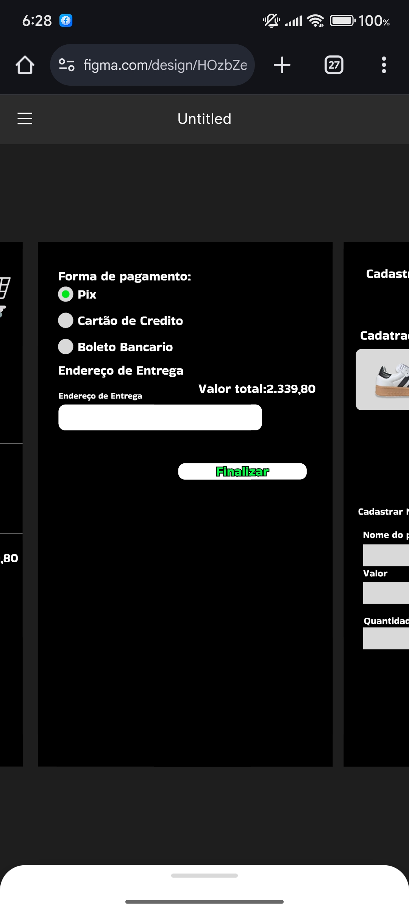
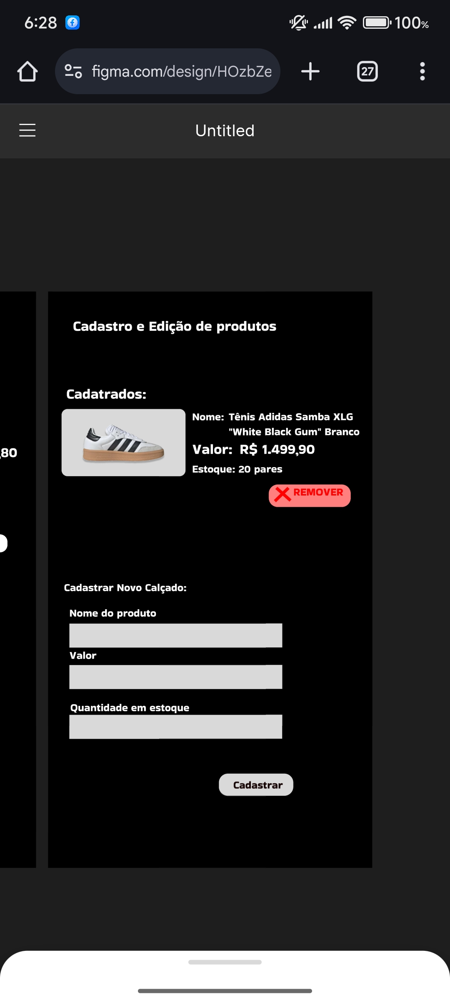

## Vortex 🚀

## Equipe de desenvolvimento

|       Equipe de Desenvolvimento - Los Vaqueiros        |
|--------------------------------------------------------|
| Pedro Yan de Oliveira Firmino / pedroooo3wd            |
| Adilio Carvalho Ferreira Filho   / Adilio990           |
| Felipe Alcantara de Assis  / lipehhs                   |
| Pedro Campos Miranda  / Pedro-CamposMiranda            |
| João Marcelo Cunha Viana  / joaozit0z                  |

## Descrição do software 📋

Nosso software será desenvolvido com foco exclusivo na revenda de tênis e calçados. 
Ele será criado em Kotlin, com interface de prototipagem em XML, garantindo um desenvolvimento mais simples, navegação fluida e uma experiência limpa e intuitiva para o usuário.

Com ele, será possível encontrar modelos de marcas de grande relevância como Nike, Adidas, Puma, Versace, New Balance, Vans, Mizuno, Fila, Asics, Olympikus, Converse dentre outras e revendedores, informando fotos, preços, tamanhos disponíveis, descrição dos produtos e estoque. 
Tudo organizado de forma prática e simples, pra facilitar o controle de entrada e saída dos produtos.

O sistema também permite um CRUD (criação, listagem edição e exclusão) dos produtos da loja, 
visualizar o carrinho de compra, cadastro e login de clientes, gerar relatórios simples que mostram quais modelos estão com mais saída, serão funcionalidades presentes no projeto.

Tudo foi pensado pra otimizar o tempo do dia a dia do consumidor com: menos cliques, menos confusão, mais agilidade e mais praticidade. 

Ao abrir o App é fácil identificar onde está os produtos e acessar as principais funcionalidades.

O software tem um funcionamento leve, responde rápido e entrega o que promete. Feito pensado no comércio de tênis, com foco no cliente e na praticidade.

## TODO List do Sofware 📜 

|                       TODO List 📜                     |
|--------------------------------------------------------|
| 1 - Escolha do Produto                                 |
| 2 - Nome da Empresa                                    |
| 3 - Criação do Logotipo                                |
| 4 - Descrição do Software                              |
| 5 - Criação do modelo do software                      |

## Modelo do Sofware no figma 🌌 

